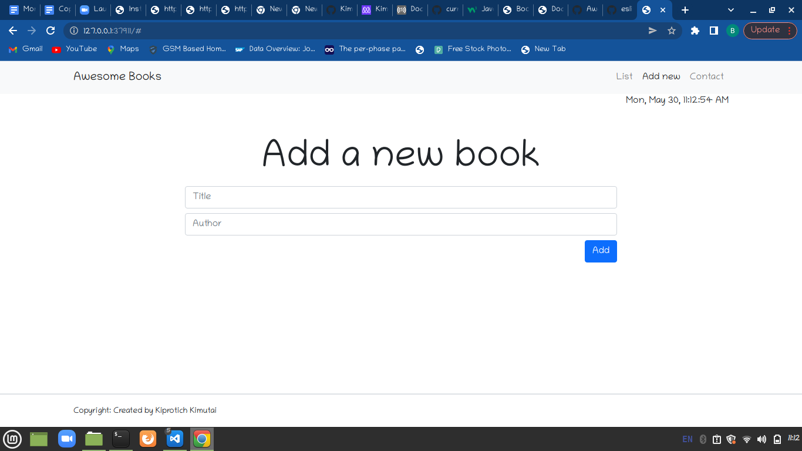
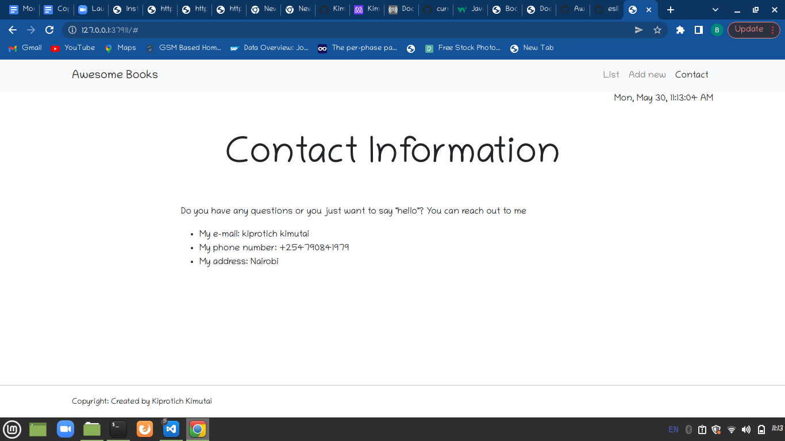
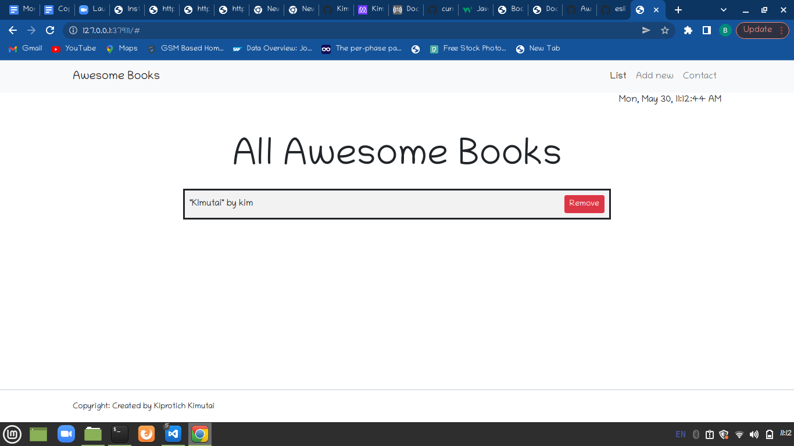

# Awesome books: plain JavaScript with objects

Awesome books is an online book store. It's built with HTML, CSS and mostly JS based on a medium-fidelity wireframe given by Microverse. Adding and removing books from the DOM is made in JavaScript functionality. Also, the books are stored in the local storage so they are retreived when the page reloads.

## Built With

- HTML5
- CSS3
- Visual Studio Code
- Git & Github

## Getting Started

To get a local copy up and running follow these simple example steps.

- Clone repo into your machine. For this, I recommend the following steps:
  - Open a terminal of your choice (e.g. VS Code integrated terminal)
  - Select the destination folder (On windows, run cd "_Destination folder_")
  - Run git clone https://github.com/Kimutai01/Awesome-books-with-es6.git
- Open the destination folder in your preferred file explorer
- Open folder "awesome-books"
- Open index.html

### Prerequisites

Any modern web browser will do.

### Setup

Follow the steps described before.

## Author

👤 **Kiprotich Kimutai**

- GitHub: [@Kimutai01](https://github.com/Kimutai01)
- Twitter: [@Kimutai_01](https://twitter.com/Kimutai_01?s=09)
- LinkedIn: [@kiprotichkimutai](https://www.linkedin.com/m/in/kimutai-kiprotich-1b5045216)

## 🤝 Contributing

Contributions, issues, and feature requests are welcome!

Feel free to check the https://github.com/silviatofana/awesome-books.

## Show your support

Give a ⭐️ if you like this project!

## Acknowledgments

- Hat tip to anyone whose code was used
- Inspiration
- Microverse program

## 📝 License

This project is [MIT](./MIT.md) licensed.
